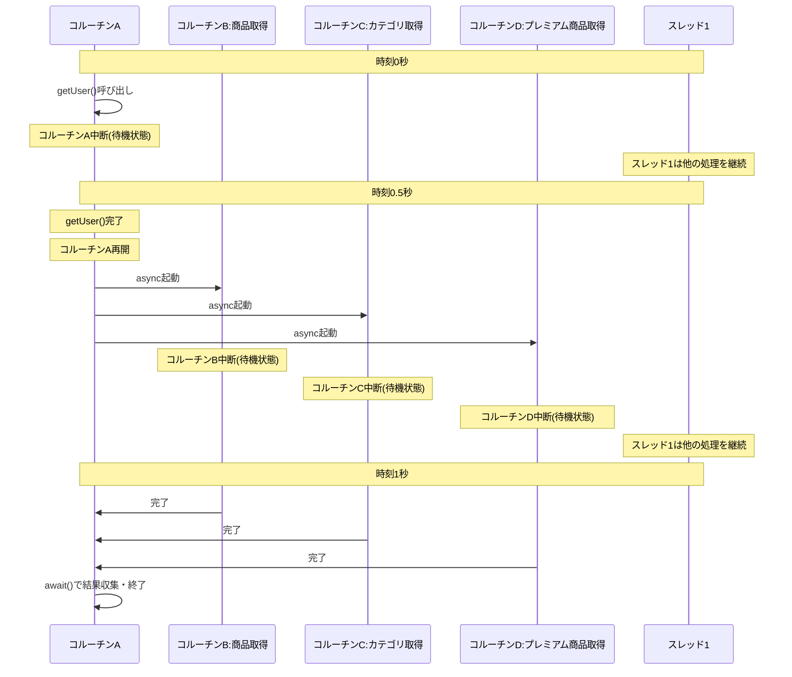
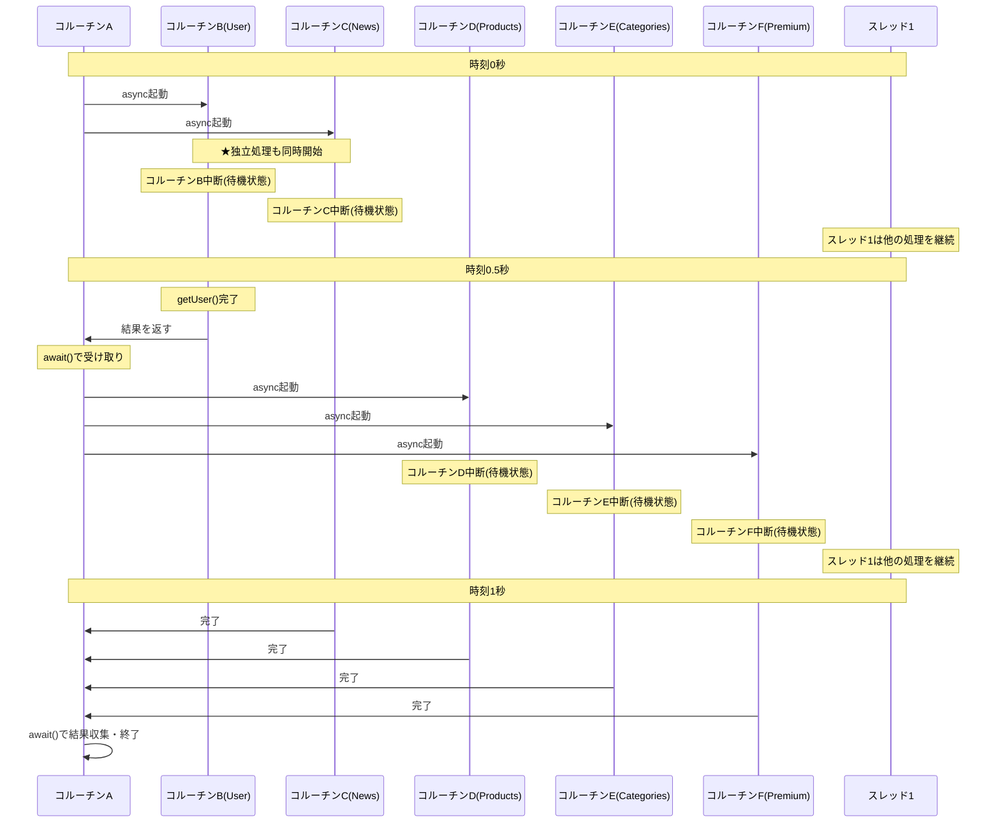

## はじめに

現在、遊撃的にWebFluxの刷新しており、Kotlin Coroutineを活用しています。

もともとCoroutineは使っていたのですが、MVCで使用していたので非同期処理を同期的に書くための文法としてのみ利用されており、並行処理にはなっていなかったです。

しかし、実際に使っていく中で「雰囲気で触っているだけで、本質を理解できていないのでは？」という疑問が湧いてきました。そこで、公式ドキュメントや関連資料を改めてさらい、基礎から学び直すことにしました。

## 想定読者

- Kotlinをバックエンド開発で使用している
- コルーチンを雰囲気で使っている
- Spring MVCは触ってことがあるが、WebFluxはない
- あるけど、コルーチンがどのようにそれぞれのライブラリで振る舞うのかよくわかっていない
- Kotlinのドキュメント何書いてあるかよくわからん

といった方を想定して書いています。

## 前提：Spring MVCでのコルーチンは並行処理ではない

この記事を読む前に、重要な前提を理解しておく必要があります。

**Spring MVCでコルーチンを使っても、それは並行処理にはなりません。**

冒頭でも触れましたが、Spring MVCでコルーチン（`suspend`関数）を使用した場合、それは「非同期処理を同期的な記法で書けるようにする」という文法的なメリットを享受しているだけです。内部的には、コルーチンが中断するたびにスレッドがブロックされ、通常のブロッキングI/Oと同じ挙動になります。

```kotlin
// Spring MVCでの例
@RestController
class UserController(private val userRepository: UserRepository) {
    
    @GetMapping("/users/{id}")
    suspend fun getUser(@PathVariable id: Long): User {
        // suspend関数だが、MVCではスレッドがブロックされる
        return userRepository.findById(id) // スレッドが待機状態になる
    }
}
```

このコードは `suspend` を使っていますが、**実際にはスレッドをブロックしています**。`findById()` が完了するまで、リクエストを処理しているスレッドは解放されません。

一方、**Spring WebFluxでコルーチンを使う場合は、真の非同期・ノンブロッキング処理**になります。I/O待機中にスレッドが解放され、他のリクエスト処理に使えるようになります。

```kotlin
// Spring WebFluxでの例
@RestController
class UserController(private val userRepository: UserRepository) {
    
    @GetMapping("/users/{id}")
    suspend fun getUser(@PathVariable id: Long): User {
        // WebFluxではスレッドが解放される（ノンブロッキング）
        return userRepository.findById(id) // スレッドは他の処理に使われる
    }
}
```

この違いは、Spring MVCがブロッキングI/Oを前提としたアーキテクチャであるのに対し、Spring WebFluxはノンブロッキングI/Oを前提としたリアクティブアーキテクチャである点に起因します。

したがって、この記事で説明するコルーチンの並行処理の仕組みやメリットは、**Spring WebFluxや他のノンブロッキング環境で使用する場合にのみ完全に発揮されます**。Spring MVCで使う場合は、コードの可読性向上という側面でのメリットに留まることを理解してください。

同じ実装をした際の、MVCとWebFluxの振る舞いの違いについて後述するのでそちらで理解を深められるかと思います。

## コルーチンの概要と必要性

### 同期的なコードの問題

まず、最もシンプルな同期的なコードから見てみましょう。WebAPIでデータベースからユーザー情報を取得する処理を考えてみます。

```kotlin
@RestController
class UserController(private val userRepository: UserRepository) {
    
    @GetMapping("/users/{id}")
    fun getUser(@PathVariable id: Long): User {
        val user = userRepository.findById(id) // DB問い合わせ: 100msかかる
        return user
    }
}
```

このコードは一見シンプルで分かりやすいですが、致命的な問題があります。`findById()` が完了するまでの100ms間、**リクエストを処理しているスレッドが完全にブロック**されてしまうのです。

Tomcatのデフォルト設定では200スレッドしかないため、200件の同時リクエストでスレッドプールが枯渇します。201件目のリクエストは待たされることになり、スループットが大きく制限されます。

この問題を解決するには、時間のかかる処理を**非同期**で実行する必要があります。つまり、I/O待機中にスレッドを解放し、他のリクエスト処理に使えるようにするということです。

### 従来のアプローチ：スレッドによる非同期処理

この問題に対する伝統的な解決策は、スレッドプールを使って処理を別のスレッドで実行することでした。

```kotlin
@RestController
class UserController(
    private val userRepository: UserRepository,
    private val executorService: ExecutorService
) {
    @GetMapping("/users/{id}")
    fun getUser(@PathVariable id: Long): CompletableFuture<User> {
        return CompletableFuture.supplyAsync({
            userRepository.findById(id) // 別スレッドで実行
        }, executorService)
    }
}
```

この方法で、リクエストハンドリングスレッドをブロックせずに処理を実行できます。しかし、スレッドベースのアプローチには深刻な制約があります。

まず、**リソースの制約**です。スレッドは非常に「重い」リソースで、1つあたり約1MB〜2MBのメモリを消費します。そのため、実用的には数百個〜数千個程度しか作成できません。また、スレッド間の切り替え（コンテキストスイッチ）はCPUに負荷をかけ、大量のスレッドがあるとパフォーマンスが急激に悪化します。

 > さらに、**開発の複雑さ**も問題です。スレッド間の通信は煩雑で、バックエンドでもUIスレッド（メインスレッド）への切り戻しを明示的に行う必要があります。加えて、エラーハンドリングやキャンセル処理が複雑になりがちで、デッドロックやレースコンディションといったバグを生みやすくなります。

 書き込みがある場合は、上記も問題になってくるでしょう。ただ、自分はここに関しては実務で直面したことはないのでAIの受け売りの引用だけ書いておきます。

### スレッドの限界：スケーラビリティの問題

例えば、1万件の同時接続を処理する必要がある場合（いわゆるC10K問題）を考えてみましょう。各接続に1つのスレッドを割り当てるアプローチでは。

- **メモリ消費**: 10,000スレッド × 2MB = 約20GBのメモリが必要
- **コンテキストスイッチのオーバーヘッド**: 大量のスレッド間の切り替えでCPUリソースが枯渇
- **スケーラビリティの限界**: 接続数が増えるほどパフォーマンスが急激に悪化

といった問題に直面します。

Spring MVCだとがまさにスレッドによる並列処理をするものなので、この問題に直面してしまいます。私がWebFlux乗り換えをしようと思ったきっかけでもあります。

### コルーチンによる軽量な非同期処理

Kotlin Coroutineは、スレッドの制約を克服しつつ、シンプルなコードで非同期処理を実現する仕組みです。簡単に言えば「途中で一時停止・再開できる、軽量な処理の単位」です。

コルーチンがスレッドの問題を解決できる理由は、3つの大きな特徴にあります。

**特徴1：圧倒的な軽量性**

スレッドが1つあたり1MB〜2MBのメモリを消費するのに対し、コルーチンは1つあたり数十バイト程度しか消費しません。この違いにより、数万〜数十万個のコルーチンを同時に実行可能で、10万件の同時接続も現実的に処理できるようになります。

**特徴2：効率的なリソース利用**

コルーチンはI/O待ち時にスレッドを占有しません。待機中のスレッドは他のコルーチンが利用できるため、少数のスレッド（例えば数十個）で大量の並行処理を実現できます。これにより、スレッドプールが枯渇する問題から解放されます。

**特徴3：構造化された並行性**

コルーチンには「親コルーチンがキャンセルされると、子も自動的にキャンセルされる」という仕組みが組み込まれています。これにより、メモリリークを防ぐライフサイクル管理が自動的に行われ、リソースの適切なクリーンアップが保証されます。

これらの特徴により、コルーチンを使うことで、スレッドのような複雑さを避けながら、スケーラブルで効率的な非同期処理を実現できます。次のセクションでは、コルーチンの基本構成要素を詳しく見ていきましょう。

## コルーチンの基本構成要素

コルーチンを使いこなすには、3つの基本要素を理解する必要があります。順番に見ていきましょう。

### 1. コルーチンビルダー：コルーチンを「起動」する関数

コルーチンを起動するための関数がコルーチンビルダーです。主に3つあります。

#### launch：「起動して、結果は気にしない」

`launch`は「とにかく実行して！結果は要らない！」という時に使います。

```kotlin
fun main() = runBlocking {
    println("プログラム開始")
    
    // launchで新しいコルーチンを起動
    launch {
        delay(1000) // 1秒待つ
        println("1秒後のメッセージ")
    }
    
    println("launchの後すぐ実行される")
    // プログラム開始
    // launchの後すぐ実行される
    // （1秒後）1秒後のメッセージ
}
```

`launch`には3つの重要な特徴があります。まず、戻り値として`Job`（処理の管理チケットのようなもの）を返します。次に、処理の結果を返さない（返せない）設計になっています。そのため、「ログ出力」「データ保存」など、結果が不要な処理に最適です。

戻り値は`Job`です。これについては後述します。

#### async / await：「起動して、結果を受け取りたい」

`async`は「実行して、後で結果が欲しい！」という時に使います。戻り値は`Job`を継承した`Deferred`です。

```kotlin
fun main() = runBlocking {
    println("計算開始")
    
    // asyncで計算を開始（Deferredを返す）
    val deferred = async {
        delay(1000) // 重い計算を模擬
        42 // 計算結果
    }
    
    println("計算は別で動いてる。他の処理もできる")
    delay(500)
    println("500msec経過")
    
    // awaitで結果を取得（まだ終わってなければ待つ）
    val result = deferred.await()
    println("計算結果: $result")
}
```

**出力**。

```
計算開始
計算は別で動いてる。他の処理もできる
500msec経過
計算結果: 42
```

**async/awaitの使い分け**。

```kotlin
// ❌ こうすると遅い（逐次実行）
suspend fun fetchDataSlow(): Pair<User, List<Post>> {
    val user = fetchUser() // 1秒かかる
    val posts = fetchPosts() // 1秒かかる
    return user to posts
    // 合計2秒
}

// ✅ asyncを使うと速い（並列実行）
suspend fun fetchDataFast(): Pair<User, List<Post>> = coroutineScope {
    // 2つを「同時に」開始
    val userDeferred = async { fetchUser() } // 1秒かかる
    val postsDeferred = async { fetchPosts() } // 1秒かかる
    
    // 両方の結果を待つ
    val user = userDeferred.await()
    val posts = postsDeferred.await()
    
    return@coroutineScope user to posts // 合計1秒（並列実行されるから）
}
```

:::details return@coroutineScopeとは？
`return@coroutineScope` は「`coroutineScope`ブロックから値を返す」という意味です。

通常の`return`だと外側の関数から抜けてしまうため、`@coroutineScope`を付けてどこから返すかを明示する必要があります。これを**ラベル付きreturn**と呼びます。

Kotlinでは、ラムダ式やブロック内から特定のスコープに値を返したい場合に、この構文を使用します。
:::

#### runBlocking：「普通の世界とコルーチンの世界を繋ぐ」

`runBlocking`は特殊なビルダーで、「コルーチンじゃない普通の関数」から「コルーチンの世界」に入るための橋渡しです。

```kotlin
// 普通の関数（コルーチンじゃない）
fun main() = runBlocking { // ← ここでコルーチンの世界に入る
    // ここからコルーチンの世界
    launch {
        delay(1000)
        println("完了")
    }
    println("待機中")
} // ← ここで、中のコルーチンが全部終わるまで待つ
```

`runBlocking`の最も重要な特徴は、中のコルーチンが全て終わるまで、呼び出したスレッドをブロック（待機）することです。この特性から、**本番のアプリコードでは使わない**のが鉄則です。

ただし、以下の3つの場面では適切に使用できます。1つ目は`main`関数（学習用のサンプルコード）、2つ目はテストコード、3つ目は既存の同期的なコードとの橋渡しです。

では、なぜ本番コードで避けるべきなのでしょうか？

`runBlocking`は名前の通り、スレッドを「ブロック」します。特にWebアプリケーションでリクエストハンドリングスレッドで`runBlocking`を使うと、スレッドプールが枯渇する原因になります。

```kotlin
// ❌ 悪い例：リクエストスレッドをブロックする
@RestController
class UserController(private val userService: UserService) {
    
    @GetMapping("/users/{id}")
    fun getUser(@PathVariable id: Long): User {
        return runBlocking { // リクエストスレッドが3秒間ブロック！
            delay(3000)
            userService.findById(id)
        }
    }
}

// ✅ 良い例：サスペンド関数を使う
@RestController
class UserController(private val userService: UserService) {
    
    @GetMapping("/users/{id}")
    suspend fun getUser(@PathVariable id: Long): User {
        delay(3000) // スレッドはブロックされず、他のリクエストを処理できる
        return userService.findById(id)
    }
}
```

**使用例：テストコード（これは適切な使用例）**

```kotlin
@Test
fun testSuspendFunction() = runBlocking {
    // テストでは問題ない（テストスレッドをブロックするだけ）
    val result = fetchUser("123")
    assertEquals("太郎", result.name)
}
```

### 2. CoroutineScope：コルーチンの「実行範囲」を定義

#### CoroutineScopeとは？

CoroutineScopeは、**コルーチンの寿命を管理する枠組み**です。

前のセクションで学んだ`launch`や`async`といったコルーチンビルダーは、実は必ず「どこかのScope」の中で実行する必要があります。例えば。

```kotlin
// ❌ これはエラー！Scopeがない
fun someFunction() {
    launch { // コンパイルエラー：Unresolved reference: launch
        // 処理
    }
}

// ✅ これはOK：Scopeの中で実行
fun someFunction() = runBlocking { // runBlockingがScopeを提供
    launch { // Scopeがあるので起動できる
        // 処理
    }
}
```

つまり、**`launch`や`async`といったコルーチンビルダーは、必ず「どこかのScope」の中でしか使えない**という関係になっています。

:::details launchはCoroutineScopeの拡張関数
Kotlinの機能で、既存のクラスを変更せずに新しい関数を追加できる仕組みです。例えば。

```kotlin
// String型に新しい関数を追加する例
fun String.addPrefix(): String = "PREFIX_$this"

// 使い方
"test".addPrefix() // "PREFIX_test"
```

`launch`は`CoroutineScope`の拡張関数として定義されているため、実際には`CoroutineScope.launch()`のように「Scopeに対して」呼び出す形になります。そのため、Scopeがない場所では`launch`を呼び出せません。
:::

Scopeには次のような役割があります。

**役割1：コルーチンの実行範囲を定める**

Scopeは「このコルーチンはどの範囲で実行されるべきか」を定義します。例えば。

- リクエストのスコープ：リクエスト処理が終わったら終了
- サービスのスコープ：アプリケーションが動いている間は有効

**役割2：親子関係による自動管理**

Scopeの中で起動されたコルーチンは、親子関係を持ちます。

```kotlin
scope.launch { // 親コルーチン
    launch { // 子コルーチン1
        // 処理A
    }
    launch { // 子コルーチン2
        // 処理B
    }
}
```

この親子関係により、次のような自動管理が行われます。

- 親がキャンセルされると、子も自動的にキャンセルされる
- 子のどれかが例外を投げると、親に伝播する
- 親は全ての子が完了するまで待つ

**役割3：リソースリークの防止**

Scopeを適切に使うことで、コルーチンが不要になったときに自動的にクリーンアップされます。これにより、メモリリークやCPUの無駄遣いを防げます。

#### コルーチンとコルーチンスコープの入れ子構造

コルーチンの中でコルーチンスコープを作ることができます。

```kotlin
someScope.launch { // ← コルーチンAを起動
    // コルーチンAの中
    
    coroutineScope { // ← 新しいスコープを作る（コルーチンAは継続）
        // まだコルーチンAの中で実行されている
        async { } // 子コルーチンB
        async { } // 子コルーチンC
    } // すべての子の完了を待つ
    
    // コルーチンAに戻る
}
```

入れ子構造のポイント。

- **新しいコルーチンを作るもの**：`launch`、`async`
- **新しいスコープを作るだけ**：`coroutineScope`、`supervisorScope`（親コルーチンをそのまま使う）
- **ディスパッチャーを切り替えるだけ**：`withContext`（親コルーチンをそのまま使う）

これにより、親コルーチンの中で子コルーチンたちをグループ化して管理できます。

#### 主なCoroutineScopeの種類

実際の開発では、いくつかの代表的なScopeを使い分けます。

**1. GlobalScope（アプリケーション全体のスコープ）**

```kotlin
GlobalScope.launch {
    // アプリケーションが終了するまで動き続ける
}
```

- **使用場面**：ほぼ使わない（本番コードでは非推奨）
- **特徴**：アプリケーション全体の寿命と同じ
- **問題点**：ライフサイクル管理ができず、メモリリークの原因になる

**2. coroutineScope（構造化された一時的なスコープ）**

```kotlin
suspend fun processData() = coroutineScope {
    val result1 = async { fetchData1() }
    val result2 = async { fetchData2() }
    
    // 両方が完了するまで待つ
    combineResults(result1.await(), result2.await())
}
```

- **使用場面**：suspend関数内で複数の並列処理をまとめたい時
- **特徴**：すべての子コルーチンが完了するまで関数が終わらない
- **重要**：**子コルーチンの1つが失敗すると、他の子コルーチンもすべてキャンセルされる**
- **メリット**：構造化された並行性により、リソースリークを防げる

**3. supervisorScope（子の失敗を分離するスコープ）**

```kotlin
suspend fun fetchMultipleData() = supervisorScope {
    val result1 = async { fetchData1() } // 失敗する可能性
    val result2 = async { fetchData2() } // 失敗しても続行
    
    // result1が失敗してもresult2は実行される
    val data1 = try { result1.await() } catch (e: Exception) { null }
    val data2 = try { result2.await() } catch (e: Exception) { null }
    
    listOfNotNull(data1, data2)
}
```

- **使用場面**：複数の独立した処理を並列実行し、一部が失敗しても他を続けたい時
- **特徴**：子コルーチンの失敗が他の子コルーチンに伝播しない
- **違い**：`coroutineScope`は1つ失敗すると全体がキャンセル、`supervisorScope`は失敗した子だけキャンセル
- **メリット**：部分的な失敗を許容できる

**4. カスタムScope（独自のライフサイクルを持つスコープ）**

一度も使用したことないです。

```kotlin
class MyService : CoroutineScope {
    private val job = SupervisorJob()
    override val coroutineContext = Dispatchers.Default + job
    
    fun startBackgroundTask() {
        launch {
            // このServiceのライフサイクルに紐付いた処理
        }
    }
    
    fun cleanup() {
        job.cancel() // Serviceの終了時に全コルーチンをキャンセル
    }
}
```

- **使用場面**：サービスやコンポーネントに紐付いた長期実行タスク（例：バックグラウンドでの一括メール送信、定期的なキャッシュリフレッシュ、KafkaやRabbitMQなどのメッセージキューからのイベント処理など）
- **特徴**：ライフサイクルを明示的に管理できる
- **メリット**：適切なタイミングでクリーンアップできる

**4. Spring WebFluxの自動管理（リクエストスコープ）**

```kotlin
@RestController
class UserController {
    @GetMapping("/users/{id}")
    suspend fun getUser(@PathVariable id: Long): User {
        // Spring WebFluxが自動的にリクエストスコープで実行
        return userService.findById(id)
    }
}
```

- **使用場面**：Spring WebFluxなどのフレームワークを使う場合
- **特徴**：フレームワークが自動的にスコープを管理（リクエストスコープなど）
- **メリット**：明示的なScope管理が不要

:::message
Spring WebFluxでは、サスペンド関数を使うだけで自動的に適切なスコープで実行されます。詳細は別の記事で解説します。
:::

#### 適切にScopeを切らないとどうなるか？

適切なスコープを使わないと、リソースリークやシャットダウンの問題が発生します。

```kotlin
// ❌ 悪い例：GlobalScopeを使うと問題が起こる
@RestController
class DataProcessController {
    @PostMapping("/process")
    fun startProcessing(): String {
        GlobalScope.launch {
            val data = fetchLargeDataSet() // 10分かかる
            processData(data)
            saveResults(data)
        }
        return "Processing started" // すぐに返る
    }
}
```

この実装の問題点:

- **リソースリーク**: リクエストが終了してもコルーチンは動き続ける
- **シャットダウンの問題**: アプリケーション終了時に処理が残ったままになる
- **管理不能**: 起動したコルーチンを制御する手段がない

解決策は、適切なスコープ（`coroutineScope`など）を使うか、フレームワーク管理のスコープに任せることです。

```kotlin
// ✅ 良い例：適切なスコープで管理
suspend fun processDataSafely(data: Data): Result = coroutineScope {
    val processed = async { processData(data) }
    val saved = async { saveResults(processed.await()) }
    Result.success(saved.await())
}
// 関数が終了すると、Scopeも自動的に終了する
```

### 3. suspend関数：「一時停止できる関数」の目印

`suspend` キーワードは「この関数は途中で一時停止するかもしれない」という目印です。

そして、一時停止している間は**スレッドを解放**できるという重要な特徴があります。これにより、そのスレッドは他のコルーチンが利用できるようになります。

#### なぜsuspendが必要なのか？

ネットワーク通信のように「結果が返ってくるまで待つ」処理では、その待ち時間にスレッドを占有するのはもったいないですよね。

```kotlin
// suspend関数（途中で一時停止できる）
suspend fun fetchUserData(): User {
    return withContext(Dispatchers.IO) {
        delay(1000) // ← ここで一時停止（スレッドは解放される）
        apiService.getUser() // ネットワーク通信
    }
}
```

:::message alert
**重要：`suspend`をつけただけでは一時停止しない**

`suspend`キーワードは「一時停止する可能性がある」という目印ですが、**キーワードをつけただけでは実際には一時停止しません**。

実際に一時停止するには、**中断ポイント（suspension point）**が必要です。

```kotlin
// ❌ suspend付いているが一時停止しない
suspend fun simpleCalculation(): Int {
    return 1 + 1  // 中断ポイントがない → 普通の関数と同じ
}

// ✅ suspend付いていて実際に一時停止する
suspend fun fetchData(): String {
    delay(1000)  // ← 中断ポイント（他のsuspend関数を呼ぶ）
    return "data"
}
```

**中断ポイントになるもの：**

- 他のsuspend関数を呼び出す（`delay()`, `await()`, API呼び出しなど）
- `withContext()`でディスパッチャーを切り替える
- `suspendCoroutine`などの低レベルAPIを使う

**順次実行はデフォルト：**

suspend関数を順番に呼ぶと、それぞれの完了を待ってから次に進みます。

```kotlin
suspend fun loadUserData(userId: Long) {
    val user = fetchUser(userId)      // 完了を待つ
    val orders = fetchOrders(userId)  // userが取得できてから実行
    println("User: $user, Orders: $orders")
}
```

これはKotlin公式ドキュメントの[Composing suspending functions](https://kotlinlang.org/docs/composing-suspending-functions.html)で「Sequential by default」として説明されています。

**並列実行したい場合：**

独立した処理を同時に実行したい場合は、`async`と`await`を使います。

```kotlin
suspend fun loadUserDataFast(userId: Long) = coroutineScope {
    // 並列実行：同時に開始
    val userDeferred = async { fetchUser(userId) }
    val ordersDeferred = async { fetchOrders(userId) }
    
    // 両方の完了を待つ
    val user = userDeferred.await()
    val orders = ordersDeferred.await()
    println("User: $user, Orders: $orders")
}
```

:::message
`coroutineScope`、`async`、`await`については後述します。ここでは「並列実行には別の方法がある」ということを理解してください。
:::

:::

#### suspend関数の重要なルール

suspend関数は、他のsuspend関数かコルーチンの中からしか呼べない

```kotlin
// ❌ これはエラー！
fun normalFunction() {
    fetchUserData() // コンパイルエラー：suspend関数は普通の関数から呼べない
}

// ✅ これはOK
suspend fun anotherSuspendFunction() {
    fetchUserData() // suspend関数同士ならOK
}

// ✅ これもOK（実際のWebアプリの場合）
@Service
class UserService(private val userRepository: UserRepository) {
    suspend fun loadUserData(id: Long): User {
        return userRepository.findById(id) // コルーチンの中ならOK
    }
}
```

**なぜこのルールがあるの？**
suspend関数は「一時停止」という特殊な処理をします。普通の関数はそれを理解できないので、コルーチンという特別な環境の中でしか実行できないのです。

#### 実用例：外部API呼び出し

```kotlin
// ユーザー情報を取得する（suspend関数）
suspend fun fetchUser(id: Long): User {
    // withContextで「IO処理用のスレッド」に切り替え
    return withContext(Dispatchers.IO) {
        // 外部API呼び出し（時間がかかる）
        externalApiClient.getUser(id) // ここで一時停止
    }
}

// 投稿一覧を取得する（suspend関数）
suspend fun fetchPosts(userId: Long): List<Post> {
    return withContext(Dispatchers.IO) {
        externalApiClient.getPosts(userId) // ここで一時停止
    }
}

// これらを使う（Spring WebFluxのControllerの場合）
@RestController
class UserController(
    private val userService: UserService,
    private val postService: PostService
) {
    @GetMapping("/users/{id}/with-posts")
    suspend fun getUserWithPosts(@PathVariable id: Long): UserWithPosts {
        val user = fetchUser(id) // 一時停止して待つ
        val posts = fetchPosts(user.id) // 一時停止して待つ
        return UserWithPosts(user, posts)
    }
}
```

この例のポイント。

- `fetchUser`と`fetchPosts`は両方とも suspend関数
- 呼び出し側から見ると、普通の関数のように「順番に」書ける
- でも内部では、待っている間スレッドを解放して他の処理ができる

## ディスパッチャー：「どこで」実行するかを制御

ディスパッチャー（Dispatcher）は「このコルーチンをどのスレッドで実行するか」を決める仕組みです。

### ディスパッチャーとスコープ、ビルダーの関係

これまで学んだ要素がどう組み合わさるか見てみましょう。

```kotlin
// runBlockingでScopeを作る
fun main() = runBlocking {  // ← Scope
    
    // Scopeの中でビルダーを使ってコルーチンを起動
    // ビルダーの引数でディスパッチャーを指定
    launch(Dispatchers.IO) {  // ← ビルダー + ディスパッチャー
        // IOディスパッチャーで実行される処理
        fetchDataFromDatabase()
    }
    
    launch(Dispatchers.Default) {  // ← 別のディスパッチャー
        // Defaultディスパッチャーで実行される処理
        heavyCalculation()
    }
}
```

**ポイント**。

- **Scope**：コルーチンの寿命を管理
- **ビルダー**（`launch`、`async`）：コルーチンを起動
- **ディスパッチャー**：ビルダーの引数として渡し、どのスレッドで実行するかを指定

### なぜディスパッチャーが必要？

**結論：処理内容によって「適切なスレッドプール」が違うから**です。

例えば、Webアプリケーションでは様々な種類の処理があります。

- **CPU集約的な処理**：暗号化、大量のデータ処理など → 専用のスレッドプールで実行すべき
- **I/O処理**：データベースアクセス、外部API呼び出しなど → I/O専用のスレッドプールで実行すべき
- **軽量な処理**：簡単な計算やデータ変換など → 現在のスレッドで実行すれば十分

これらを同じスレッドプールで実行すると、CPU処理がI/O待ちのスレッドを占有したり、逆にI/O処理がCPU用のスレッドを無駄に占有したりして、効率が悪くなります。ディスパッチャーを使うことで、それぞれの処理に最適なスレッドプールを選択できます。

:::message
**ディスパッチャーを指定しない場合**
明示的にディスパッチャーを指定しない場合、**`Dispatchers.Default`** が使われます。

```kotlin
// ディスパッチャーを指定しない
launch {
    // Dispatchers.Defaultで実行される
}

// 明示的に指定する
launch(Dispatchers.IO) {
    // Dispatchers.IOで実行される
}
```

ただし、親のコルーチンがディスパッチャーを持っている場合は、その設定を引き継ぎます。
:::

### ディスパッチャーを使うメソッド

ディスパッチャーを指定する方法は主に2つあります。

| 方法 | 使い方 | タイミング | 用途 |
|------|--------|-----------|------|
| **ビルダー引数** | `launch(Dispatchers.IO) { }` | コルーチン起動時 | 新しいコルーチンを特定のディスパッチャーで実行したい |
| **withContext** | `withContext(Dispatchers.IO) { }` | コルーチン実行中 | 既存のコルーチン内で一時的にディスパッチャーを切り替えたい |

#### 1. ビルダーの引数として指定

コルーチンを起動する時に、ビルダーの引数としてディスパッチャーを渡します。

```kotlin
launch(Dispatchers.IO) {
    // IOディスパッチャーで実行される
    fetchDataFromDatabase()
}

async(Dispatchers.Default) {
    // Defaultディスパッチャーで実行される
    heavyCalculation()
}
```

**特徴**。

- **新しいコルーチンを起動**する
- 起動時にディスパッチャーを決定
- 並列実行が可能

#### 2. withContextで途中から切り替え

**`withContext`の重要な特徴：既にあるコルーチンの中で、ディスパッチャーだけを一時的に切り替える**

`launch`は新しいコルーチンを起動しますが、`withContext`は**今動いているコルーチンのまま、実行するスレッドだけを変更**します。

**特徴**。

- **既存のコルーチン内で**ディスパッチャーを切り替える
- 処理完了まで待機してから次に進む（順次実行）
- 結果を戻り値として受け取れる

**使用例：コルーチン内でのディスパッチャー切り替え**

以下の例では、コルーチンビルダー（`launch`）でコルーチンを起動し、その中でサービスの`suspend`関数を呼び出しています。
サービス層の`processUserData`関数内では、`withContext`を使って処理ごとに適切なディスパッチャーに切り替えています。

```kotlin
// どこかでlaunchを使ってコルーチンを起動
// （実際のアプリではフレームワークが自動で行う）
fun main() = runBlocking {
    launch { // Dispatchers.Defaultで起動
        val service = UserService()
        val result = service.processUserData(123)
        println(result)
    }
}

// サービス層：suspend関数内でwithContextを使ってディスパッチャーを切り替える
class UserService {
    suspend fun processUserData(userId: Long): String {
        // Defaultで実行されている状態から、IOに切り替え
        val userData = withContext(Dispatchers.IO) {
            database.fetchUser(userId)
        } // ← IOでの処理が終わったらDefaultに戻る
        
        // Defaultに戻った状態から、再びDefaultを明示的に指定
        val validatedData = withContext(Dispatchers.Default) {
            validateAndTransform(userData)
        }
        
        // Defaultで実行されている状態から、IOに切り替え
        withContext(Dispatchers.IO) {
            database.save(validatedData)
        } // ← IOでの処理が終わったらDefaultに戻る
        
        return "処理完了: ${validatedData.id}"
    }
}
```

**launchでは代替できない理由**

`launch`を使うと、各処理が並列に実行されてしまい、前のステップの結果を待たずに次に進んでしまいます。

```kotlin
// ❌ これは動かない
suspend fun processUserDataWrong(userId: Long): String = coroutineScope {
    launch(Dispatchers.IO) {
        userData = database.fetchUser(userId)
    }
    // userDataがまだ取得されていないのに次に進む
    
    launch(Dispatchers.Default) {
        validatedData = validateAndTransform(userData!!) // NullPointerException!
    }
    
    return "処理完了"
}
```

**withContextとlaunchの使い分け**。

| 特徴 | withContext | launch / async |
|------|-------------|---------------|
| **役割** | ディスパッチャーを切り替える | 新しいコルーチンを起動する |
| **実行方法** | 同じコルーチン内で順次実行 | 新しいコルーチンを並列実行 |
| **結果の受け取り** | 処理結果を直接返せる | `launch`: 返せない / `async`: `await()`で取得 |
| **用途** | ブロッキングAPIの実行スレッドを切り替える | 独立した処理を並列実行したい場合 |

:::message alert
**並列実行したいときは`withContext`を使わない！**

`withContext`は順次実行されるため、**並列実行には向きません**。
独立した複数の処理を同時に実行したい場合は、`launch`や`async`を使いましょう。
:::

`withContext`は、指定したディスパッチャーでブロック内の処理を実行し、完了したら結果を返します。処理が終わると、元のディスパッチャーに自動的に戻ります。

:::message
**Spring MVCとSpring WebFluxでのwithContext使用の違い**

Springでコルーチンを使う場合、MVCとWebFluxでは推奨されるコーディングスタイルが異なります。

### Spring MVC：ブロッキングAPIを使う従来型アプローチ

Spring MVCでコルーチンを使う場合、既存の同期的なライブラリ（RestTemplate、FeignClient、JdbcTemplateなど）をそのまま使うことが多いです。これらはスレッドをブロックするため、`withContext(Dispatchers.IO)`でI/O専用スレッドプールに切り替える必要があります。

```kotlin
@RestController
class UserController(
    private val restTemplate: RestTemplate,
    private val jdbcTemplate: JdbcTemplate
) {
    @GetMapping("/users/{id}")
    suspend fun getUser(@PathVariable id: Long): User {
        // ブロッキングAPIなので、Dispatchers.IOが必要
        return withContext(Dispatchers.IO) {
            restTemplate.getForObject("/api/users/$id", User::class.java)!!
        }
    }
    
    @GetMapping("/users/{id}/orders")
    suspend fun getUserOrders(@PathVariable id: Long): List<Order> = coroutineScope {
        // 複数のブロッキングAPIを並列実行
        val userDeferred = async(Dispatchers.IO) {
            jdbcTemplate.queryForObject(
                "SELECT * FROM users WHERE id = ?",
                UserRowMapper(),
                id
            )!!
        }
        val ordersDeferred = async(Dispatchers.IO) {
            jdbcTemplate.query(
                "SELECT * FROM orders WHERE user_id = ?",
                OrderRowMapper(),
                id
            )
        }
        
        ordersDeferred.await()
    }
}
```

### Spring WebFlux：リアクティブAPIを使うノンブロッキングアプローチ

Spring WebFluxでは、WebClientやR2DBCなどのリアクティブライブラリを使用します。これらは既に`suspend`関数として提供されており、内部でノンブロッキングに実装されているため、`withContext(Dispatchers.IO)`は不要です。

Spring公式ドキュメントの[Coroutinesセクション](https://docs.spring.io/spring-framework/reference/languages/kotlin/coroutines.html)でも、以下のように`Dispatchers.IO`を指定せずに実装されています。

**順次実行の例：**

```kotlin
@RestController
class SequentialController(
    private val webClient: WebClient
) {
    @GetMapping("/sequential")
    suspend fun sequential(): List<Banner> {
        // 順次実行：ディスパッチャー指定なし
        val banner1 = webClient.get()
            .uri("/suspend")
            .accept(MediaType.APPLICATION_JSON)
            .awaitExchange()
            .awaitBody<Banner>()
        
        val banner2 = webClient.get()
            .uri("/suspend")
            .accept(MediaType.APPLICATION_JSON)
            .awaitExchange()
            .awaitBody<Banner>()
        
        return listOf(banner1, banner2)
    }
}
```

**並列実行の例：**

```kotlin
@RestController
class ParallelController(
    private val webClient: WebClient
) {
    @GetMapping("/parallel")
    suspend fun parallel(): List<Banner> = coroutineScope {
        // 並列実行：async使用、ディスパッチャー指定なし
        val deferredBanner1 = async {
            webClient.get()
                .uri("/suspend")
                .accept(MediaType.APPLICATION_JSON)
                .awaitExchange()
                .awaitBody<Banner>()
        }
        
        val deferredBanner2 = async {
            webClient.get()
                .uri("/suspend")
                .accept(MediaType.APPLICATION_JSON)
                .awaitExchange()
                .awaitBody<Banner>()
        }
        
        listOf(deferredBanner1.await(), deferredBanner2.await())
    }
}
```

### なぜWebFluxではディスパッチャー指定が不要なのか？

- `awaitBody()`や`awaitExchange()`は**suspend関数**として実装されている
- 内部でReactor（リアクティブライブラリ）を使用し、I/O処理が既にノンブロッキング
- スレッドをブロックせず、I/O完了を待つ間にスレッドを他の処理に使える
- つまり、**I/O処理でスレッドプールを切り替える必要がない**

### ただし注意：CPU集約的な処理は別

I/O処理はノンブロッキングですが、**取得したデータに対してCPU集約的な処理を行う場合は`withContext(Dispatchers.Default)`が必要**です。

```kotlin
@RestController
class DataProcessingController(
    private val webClient: WebClient
) {
    @GetMapping("/process")
    suspend fun fetchAndProcess(): ProcessedData {
        // I/O処理：ノンブロッキング、ディスパッチャー不要
        val rawData = webClient.get()
            .uri("/large-data")
            .retrieve()
            .awaitBody<RawData>()
        
        // CPU集約的な処理：Dispatchers.Defaultに切り替え
        return withContext(Dispatchers.Default) {
            // 大量データの変換、集計、暗号化など
            processHeavyComputation(rawData)
        }
    }
}
```

### まとめ

| フレームワーク | 使用するライブラリ | I/O処理のディスパッチャー | CPU処理のディスパッチャー |
|-----------|------------|----------------|----------------|
| **Spring MVC** | RestTemplate、FeignClient、JDBC | `withContext(Dispatchers.IO)` 必要 | `withContext(Dispatchers.Default)` 必要 |
| **Spring WebFlux** | WebClient、R2DBC | ディスパッチャー指定不要 | `withContext(Dispatchers.Default)` 必要 |

**判断のポイント：**

- MVCで**ブロッキングAPI**（RestTemplate、FeignClient、JDBC等）を使う場合 → `withContext(Dispatchers.IO)`が必要
- WebFluxで**リアクティブAPI**（WebClient、R2DBC等）を使う場合 → I/O処理にディスパッチャー指定は不要
- **どちらの場合でも**、CPU集約的な処理には`withContext(Dispatchers.Default)`が必要

:::

### 4つの主要なディスパッチャー

#### 1. Dispatchers.Default（CPU集約的な処理用）

デフォルトのスレッドプールです。CPU集約的な処理（計算、ソート、JSON解析など）に適しています。

```kotlin
withContext(Dispatchers.Default) {
    // CPU集約的な処理
    val result = complexCalculation(largeDataSet)
    val sorted = data.sortedByDescending { it.value }
}
```

`Dispatchers.Default`を使うべきなのは、CPUを集中的に使う処理です。具体的には、大量のデータの処理・変換、複雑な計算、JSON/XMLのパース、暗号化/復号化などが該当します。これらの処理は「計算そのもの」に時間がかかるため、CPU専用のスレッドプールで実行するのが適切です。

#### 2. Dispatchers.IO（入出力処理用）

ネットワーク通信、ファイル読み書き、データベース操作用です。

```kotlin
@Service
class UserService(
    private val externalApiClient: ExternalApiClient,
    private val userRepository: UserRepository
) {
    suspend fun loadUserFromExternalApi(id: Long): User {
        return withContext(Dispatchers.IO) {
            // I/O処理専用のスレッドプールで実行
            externalApiClient.getUser(id)
        }
    }
    
    suspend fun findById(id: Long): User {
        return withContext(Dispatchers.IO) {
            userRepository.findById(id) ?: throw NotFoundException()
        }
    }
}
```

`Dispatchers.IO`を使うべきなのは、入出力を伴う処理です。具体的には、外部APIの呼び出し、ファイルの読み書き、データベースのクエリ、Redis/キャッシュへのアクセスなどです。これらの処理は「待ち時間」が主体で、CPUをほとんど使わないのが特徴です。

`Dispatchers.IO`は専用のスレッドプールで管理されており、デフォルトで最大64個までスレッドを使用できます。I/O処理は待ち時間が多いため、1つのスレッドを多くのコルーチンで共有でき、効率的にリソースを活用できます。

#### 3. その他のディスパッチャー

他に`Dispatchers.Unconfined`というディスパッチャーも存在しますが、これは**テストコードやライブラリ開発など、非常に特殊なケース**でのみ使用されます。通常のアプリケーション開発では使いません。

もし「スレッド切り替えコストを極限まで削減したい」「テストで同期的に実行したい」といった特殊なケースに遭遇したら、その時に調べてみてください。

### ディスパッチャーの選び方フローチャート

```text
時間のかかる処理？
├─ Yes → どんな処理？
│   ├─ ネットワーク/DB/ファイル → Dispatchers.IO
│   └─ 計算/データ処理 → Dispatchers.Default
└─ No → ディスパッチャー指定不要（現在のスレッドで実行）
```

:::message
**軽い処理ならディスパッチャーを気にしなくてOK**

以下のような処理は、わざわざディスパッチャーを切り替える必要はありません。

- 変数の代入や簡単な計算
- リストの要素数チェックや簡単なフィルタリング
- データクラスの変換（単純なマッピング）

ディスパッチャーの切り替え自体にもわずかなコストがあるため、**時間のかかる処理だけ**気にすればOKです。
:::

## 補足：ジョブとコルーチンコンテキスト

ここまでの説明で出てこなかった重要な用語として、**ジョブ**と**コルーチンコンテキスト**があります。これらはコルーチンの内部動作に関わる概念で、基本的な使い方では意識する必要はありませんが、理解しておくとより深く理解できます。

### ジョブ（Job）

**ジョブ**は、コルーチンのライフサイクルを管理するオブジェクトです。

**主な機能：**

1. **キャンセル制御**：コルーチンをキャンセルできる
2. **完了待機**：コルーチンの完了を待つことができる
3. **親子関係の管理**：親がキャンセルされると子も自動的にキャンセル

**Jobの主要なメソッド：**

| メソッド | 説明 | 使い方 |
|---------|------|--------|
| `cancel()` | コルーチンをキャンセルする | `job.cancel()` |
| `join()` | コルーチンの完了を待つ（サスペンド関数） | `job.join()` |
| `cancelAndJoin()` | キャンセルして完了を待つ（`cancel()`+`join()`のショートカット） | `job.cancelAndJoin()` |
| `isActive` | コルーチンが実行中かどうか | `if (job.isActive) { ... }` |
| `isCompleted` | コルーチンが完了したかどうか | `if (job.isCompleted) { ... }` |
| `isCancelled` | コルーチンがキャンセルされたかどうか | `if (job.isCancelled) { ... }` |

**実用的な例：タイムアウト処理**

```kotlin
suspend fun fetchDataWithTimeout() = coroutineScope {
    val job = launch {
        // 時間のかかる処理
        fetchLargeData()
    }
    
    // 5秒待つ
    delay(5000)
    
    // まだ完了していなければキャンセル
    if (job.isActive) {
        println("タイムアウト！キャンセルします")
        job.cancelAndJoin()
    }
}
```

**ジョブの状態遷移**

ジョブは、コルーチンのライフサイクルに応じて複数の状態を遷移します。これらの状態を理解することで、コルーチンがどの段階にあるかを正確に把握できます。

| 状態 | 説明 |
|------|------|
| **New** | 作成されたが、まだ開始されていない（lazy起動の場合） |
| **Active** | 実行中 |
| **Completing** | 完了処理中（子コルーチンの完了を待っている） |
| **Completed** | 正常に完了 |
| **Cancelling** | キャンセル処理中 |
| **Cancelled** | キャンセルされて終了 |

**launchとasyncの返り値の違い：**

これまでコルーチンを起動する際に `launch` や `async` を使ってきましたが、実はこれらは起動したコルーチンを管理するためのオブジェクト（Job）を返しています。この2つのビルダーの返り値には重要な違いがあります。

コルーチンビルダーは、起動したコルーチンを管理するためのオブジェクトを返します。

| ビルダー | 返り値 | 意味 | できること |
|---------|--------|------|-----------|
| `launch` | `Job` | コルーチンの管理用オブジェクト | キャンセル、完了待機 |
| `async` | `Deferred<T>` | `Job`を継承し、結果も持つ | Jobと同様にキャンセル、完了待機が可能。そしてawaitで結果の取得も可能 |

**実際の開発では：**

Jobを明示的に扱うのは、以下のような特殊なケースです。

- バックグラウンドタスクを途中でキャンセルしたい
- 複数のコルーチンをまとめて管理したい
- カスタムスコープを作成する（サービスクラスなど）

### コルーチンコンテキスト（CoroutineContext）

**コルーチンコンテキスト**は、コルーチンの実行環境を決める「設定の集まり」です。ジョブもこのコンテキストの一部です。

**含まれる主な要素：**

- **ジョブ（Job）**：コルーチンのライフサイクル管理
- **ディスパッチャー**：どのスレッドで実行するか
- **コルーチン名**：デバッグ用の名前
- **例外ハンドラー**：エラー処理の設定

これらの要素は `+` 演算子で組み合わせることができます。例えば、ディスパッチャーとコルーチン名を指定してコルーチンを起動する場合。

```kotlin
launch(Dispatchers.IO + CoroutineName("MyCoroutine")) {
    // Dispatchers.IOとコルーチン名を含むコンテキストで実行
    println("実行中のコルーチン: ${coroutineContext[CoroutineName]}")
}
```

**コンテキストの継承と組み合わせ：**

コルーチンコンテキストには、以下の重要な特徴があります。

1. **親のコンテキストを継承する**

```kotlin
suspend fun example() = coroutineScope {
    // この coroutineScope は親のコンテキスト（Dispatchers.IOなど）を継承している
    
    launch {
        // このlaunchも親のコンテキストを継承
        println("親と同じディスパッチャーで実行される")
    }
}
```

2. **`+` 演算子で要素を組み合わせられる**

```kotlin
// 複数の要素を組み合わせる
launch(Dispatchers.IO + CoroutineName("DataFetcher") + Job()) {
    // IO スレッド + 名前 + 独立したJob で実行
    fetchData()
}
```

:::message
**`Job()` について**

`Job()` は新しいJobインスタンスを作成するファクトリ関数です。コンテキストに明示的に `Job()` を追加すると、親のJobから独立した新しいJobが作成されます。これにより、親がキャンセルされても、このコルーチンはキャンセルされません（逆に、このコルーチンがキャンセルされても親には影響しません）。

通常は親子関係を維持したいため、`Job()` を明示的に指定することは少ないです。特別な理由（親のキャンセルから独立させたいなど）がない限り、省略するのが一般的です。

```kotlin
// 通常はこう書く（親子関係を維持）
launch(Dispatchers.IO + CoroutineName("DataFetcher")) {
    fetchData()
}
```

:::

3. **子コルーチンは親のコンテキストを引き継ぐ（構造化された並行性）**

```kotlin
suspend fun processData() = coroutineScope {
    // 親のコンテキスト: Dispatchers.Default
    
    launch {
        // 子も Dispatchers.Default を継承
        println("子コルーチン1: ${Thread.currentThread().name}")
    }
    
    launch(Dispatchers.IO) {
        // 明示的に指定すると上書きされる
        println("子コルーチン2: ${Thread.currentThread().name}")
    }
}
```

この継承の仕組みにより、親がキャンセルされると子も自動的にキャンセルされ、構造化された並行性が実現されます。

**実際の開発では：**

通常のアプリケーション開発では、コルーチンコンテキストを明示的に操作することは少なく、ディスパッチャーの指定だけで十分なケースがほとんどです。

:::message
**いつ詳しく学ぶべき？**

ジョブとコルーチンコンテキストは、以下のようなケースで必要になります。

- カスタムスコープを作成する必要がある
- 複雑なキャンセル処理を実装する
- ライブラリを開発する
- 低レベルのコルーチンAPIを使う

基本的なアプリケーション開発では、この章で学んだ**Scope**、**ビルダー**、**ディスパッチャー**の理解で十分です。
:::

## 実践例：複数のAPI呼び出しを速くする

ここまでの知識を使って、実際によくある「複数の外部APIを呼ぶ」場面を最適化してみましょう。以降これを「統合API」と呼びます。

### シナリオ：統合APIエンドポイントの実装

統合APIエンドポイントを実装するには、以下の3つの外部サービスから情報を取得する必要があります。

1. ユーザーサービスからユーザー情報（1秒かかる）
2. 注文サービスから注文履歴（1秒かかる）
3. ポイントサービスからポイント残高（1秒かかる）

:::message alert
**よくある間違い：順番に処理してしまう**

3つの処理を順番に実行すると、合計3秒かかってしまいます。しかし、これらは**互いに独立した処理**なので、同時に実行できるはずです。

コルーチンを使えば、これらを並列に実行して**1秒で完了**させることができます！
:::

### 依存関係がない場合の実装

```kotlin
@Service
class UserProfileService(
    private val userApiClient: UserApiClient,
    private val orderApiClient: OrderApiClient,
    private val pointApiClient: PointApiClient
) {
    // ✅ 良い例：効率的な実行
    suspend fun getUserProfile(userId: Long): UserProfileData = coroutineScope {
        // 3つの外部APIを「同時に」開始
        // ※WebClient（WebFlux）の場合、Dispatcherの指定は不要
        // ※RestTemplate/FeignClient（MVC）の場合、async(Dispatchers.IO) と指定する
        val userDeferred = async {
            userApiClient.getUser(userId)
        }
        
        val ordersDeferred = async {
            orderApiClient.getOrders(userId)
        }
        
        val pointsDeferred = async {
            pointApiClient.getPoints(userId)
        }
        
        // 全ての結果を待つ
        val user = userDeferred.await()
        val orders = ordersDeferred.await()
        val points = pointsDeferred.await()
        
        UserProfileData(user, orders, points)
        // 合計：1秒（最も遅い処理の時間）
    }
}
```

**WebFlux vs MVC：**

使用するHTTPクライアントによって、スレッドの使い方が異なります。

**WebFlux（WebClient）の場合：**

- 1つのリクエスト内：1つのスレッドが3つのコルーチンを切り替えながら実行（**並行処理**）
- 複数のリクエスト間：少数のイベントループスレッドが複数ユーザーのリクエストを処理（**並列処理**）
- 特徴：スレッドはブロックされず、効率的に多数のリクエストを同時処理可能

**MVC（RestTemplate/FeignClient）の場合：**

- 1つのリクエスト内：`async(Dispatchers.IO)`で3つのIOスレッドが実行（**並列処理**）
- 複数のリクエスト間：各リクエストが独立したスレッドプールのスレッドで実行（**並列処理**）
- 特徴：スレッド数は多く必要だが、理解しやすいモデル

**このコードの動き（タイムライン）**。

```text
時刻0秒：3つのasyncを全て開始
  ├─ async1: ユーザー情報取得開始
  ├─ async2: 注文履歴取得開始
  └─ async3: ポイント残高取得開始

時刻1秒：3つとも完了
  ├─ async1: 完了 ✓
  ├─ async2: 完了 ✓
  └─ async3: 完了 ✓

await()で結果を受け取る（既に完了しているので即座に返る）
```

### 依存関係がある場合の実装

「ユーザー情報を取得してから、そのユーザーの設定に基づいて別の処理を行う」のように、依存関係がある場合はどうするか？

:::message
**withContextは「結果を待つ」ために使うものではない**

依存関係がある処理で結果を待ちたい場合、**ディスパッチャーの切り替えが必要でなければ`withContext`は不要**です。

- **suspend関数を呼ぶだけで結果を待てる** → `withContext`不要
- **ブロッキングAPIを呼ぶ必要がある** → `withContext(Dispatchers.IO)`が必要（スレッドを切り替えるため）

つまり、`withContext`の役割は。

- ✅ **ディスパッチャーを切り替える**（ブロッキング処理をI/Oスレッドで実行など）
- ❌ **単に結果を待つ**（これはsuspend関数の呼び出しだけで十分）

この例では、APIクライアントが既に`suspend fun getUser(): User`のように定義されていることを想定しています。
このような場合、APIクライアント側で既に適切なスレッド管理がされているため、呼び出し側で`withContext`を使う必要はありません。

もしAPIクライアントが同期的（ブロッキング）な実装の場合は、前述の「Spring MVCとWebFluxの違い」を参照してください。
:::

次のような要件を持つレコメンデーション機能を実装する2つのケースを見ていきます。

**要件：**

1. **ユーザー情報を取得**（`getUser`）
2. **ユーザー情報に依存する処理**。
   - おすすめ商品取得（`getRecommendedProducts`）
   - お気に入りカテゴリ情報取得（`getFavoriteCategories`）
   - プレミアム商品取得（`getPremiumProducts`）
3. **ユーザー情報に依存しない処理**。
   - 最新ニュース取得（`getLatestNews`）

この要件に対して、2つの異なる実装ケースを見ていきましょう。

#### ケース1：ユーザー依存の処理のみ（基本的な実装）

まずユーザー情報を取得してから、それに依存する処理を並列実行するケースです。

```kotlin
@Service
class RecommendationService(
    private val userApiClient: UserApiClient,
    private val productApiClient: ProductApiClient,
    private val categoryApiClient: CategoryApiClient
) {
    suspend fun getRecommendations(userId: Long): RecommendationData = coroutineScope {
        // ステップ1: ユーザー情報を取得（他の処理の前提条件）
        val user = userApiClient.getUser(userId)
        
        // ステップ2: ユーザー情報を使った処理を並列実行
        val productsDeferred = async {
            productApiClient.getRecommendedProducts(user)
        }
        
        val categoriesDeferred = async {
            categoryApiClient.getFavoriteCategories(user)
        }
        
        val premiumContentDeferred = async {
            productApiClient.getPremiumProducts(user)
        }
        
        RecommendationData(
            user = user,
            products = productsDeferred.await(),
            categories = categoriesDeferred.await(),
            premiumContent = premiumContentDeferred.await()
        )
    }
}
```

**WebFlux vs MVC：**

使用するHTTPクライアントによって、スレッドの使い方が異なります。

**WebFlux（WebClient）の場合：**

- 1つのリクエスト内：最初の`getUser()`で中断後、3つのasyncを同じスレッドで切り替え実行（**並行処理**）
- 複数のリクエスト間：少数のイベントループスレッドが複数ユーザーのリクエストを処理（**並列処理**）
- 特徴：スレッドはブロックされず、効率的に多数のリクエストを同時処理可能

**MVC（RestTemplate/FeignClient）の場合：**

- 1つのリクエスト内：最初は`getUser()`で1スレッドがブロック、その後3つのIOスレッドが実行（**並列処理**）
- 複数のリクエスト間：各リクエストが独立したスレッドプールのスレッドで実行（**並列処理**）
- 特徴：スレッド数は多く必要だが、理解しやすいモデル

**実行フロー：**

※以下はWebClient（WebFlux）を使用した場合の動作です。

重要な理解。

- **コルーチンの中断**: コルーチンAが結果待ちで中断されるが、スレッドはブロックされない
- **スレッドの動き**: スレッド1は他のコルーチン（B、C、Dなど）や別のリクエストを処理し続ける
  - この図では説明のため1つのリクエストのみを表示していますが、実際の本番環境では、スレッド1は複数のユーザーからの同時リクエストを次々と処理します
  - コルーチンAが中断されている間、スレッド1は別のユーザー2さんのリクエスト処理、3さんのリクエスト処理などを行います
- **MVC（RestTemplate/FeignClient）の場合**: async内でDispatchers.IOスレッドに切り替わり、そのスレッドはAPI応答までブロックされる



**特徴：**

- ✅ シンプルで理解しやすい実装
- ✅ 依存関係が明確
- ✅ 多くの場面で十分な性能

#### ケース2：独立した処理も追加（最適化した実装）

ケース1に加えて、ユーザーに依存しない処理も追加し、最初から同時実行するケースの実装をみてましょう。

**ケース1からの変更点：**

- ユーザー情報に依存しない処理（最新ニュース取得）を最初から開始する

```kotlin
@Service
class RecommendationService(
    private val userApiClient: UserApiClient,
    private val productApiClient: ProductApiClient,
    private val categoryApiClient: CategoryApiClient,
    private val newsApiClient: NewsApiClient
) {
    suspend fun getRecommendations(userId: Long): RecommendationData = coroutineScope {
        // ステップ1: 独立した処理は同時に開始
        val userDeferred = async {
            userApiClient.getUser(userId)
        }
        
        val latestNewsDeferred = async {
            newsApiClient.getLatestNews()  // ユーザーに依存しないので即座に開始
        }
        
        // ステップ2: ユーザー情報が必要になったら待つ
        val user = userDeferred.await()
        
        // ステップ3: ユーザー情報を使った処理を並列実行
        val productsDeferred = async {
            productApiClient.getRecommendedProducts(user)
        }
        
        val categoriesDeferred = async {
            categoryApiClient.getFavoriteCategories(user)
        }
        
        val premiumContentDeferred = async {
            productApiClient.getPremiumProducts(user)
        }
        
        RecommendationData(
            user = user,
            latestNews = latestNewsDeferred.await(),
            products = productsDeferred.await(),
            categories = categoriesDeferred.await(),
            premiumContent = premiumContentDeferred.await()
        )
    }
}
```

**WebFlux vs MVC：**

使用するHTTPクライアントによって、スレッドの使い方が異なります。

**WebFlux（WebClient）の場合：**

- 1つのリクエスト内：1つのスレッドが複数のコルーチンを切り替えながら実行（**並行処理**）
- 複数のリクエスト間：少数のイベントループスレッドが複数ユーザーのリクエストを処理（**並列処理**）
- 特徴：スレッドはブロックされず、効率的に多数のリクエストを同時処理可能

**MVC（RestTemplate/FeignClient）の場合：**

- 1つのリクエスト内：`async(Dispatchers.IO)`で最大5つのIOスレッドが実行（**並列処理**）
- 複数のリクエスト間：各リクエストが独立したスレッドプールのスレッドで実行（**並列処理**）
- 特徴：スレッド数は多く必要だが、理解しやすいモデル

**実行フロー：**

※以下はWebClient（WebFlux）を使用した場合の動作です。

重要な理解。

- **コルーチンの中断**: コルーチンが結果待ちで中断されるが、スレッドはブロックされない
- **スレッドの動き**: スレッド1は他のコルーチン（B、C、Dなど）や別のリクエストを処理し続ける
- **MVC（RestTemplate/FeignClient）の場合**: async内でDispatchers.IOスレッドに切り替わり、そのスレッドはAPI応答までブロックされる



**特徴：**

- ✅ 依存関係を正しく考慮しつつ、独立した処理を先行実行
- ✅ 最速の実行時間（待ち時間を最大限活用）
- ✅ スレッドを最大限効率的に活用

依存のない処理は並列で

``` text

**このコードの入れ子構造**。

```text
someScope（呼び出し元のスコープ）
  └─ launch（コルーチンA） ← 新しいコルーチンを起動
       └─ getRecommendations()
            └─ coroutineScope { } ← 新しいスコープを作る（コルーチンAは継続）
                 ├─ userApiClient.getUser() ← コルーチンAで実行（suspend関数）
                 ├─ async { } ← 子コルーチンBを起動
                 ├─ async { } ← 子コルーチンCを起動
                 └─ async { } ← 子コルーチンDを起動
```

- **新しいコルーチンを作るもの**：`launch`、`async`
- **新しいスコープを作るだけ**：`coroutineScope`（親コルーチンをそのまま使う）
- **suspend関数の呼び出し**：現在のコルーチンで実行（新しいコルーチンやスレッド切り替えは発生しない）

呼び出し側。

```kotlin
someScope.launch {
    val recommendations = recommendationService.getRecommendations(userId)
    // ...
}
```

**ポイント**。

1. 依存関係がある処理は順番に実行（suspend関数を直接呼び出す）
2. 独立した処理は同時実行（`async`を使い、後で`await`）
3. できるだけ同時実行の部分を多くすると速くなる

## よくある間違いと落とし穴

コルーチンを学び始めると、誰もが一度は踏んでしまう「よくある間違い」があります。これらは一見動いているように見えても、実は深刻な問題を引き起こす可能性があります。1つずつ見ていきましょう。

### 1. GlobalScopeの使用

:::message alert
**GlobalScopeは使わない！**

`GlobalScope`は**本番コードでは絶対に使わない**でください。以前のセクションで説明した通り、アプリケーション全体のライフサイクルに紐づいているため。

- リクエストが終了してもコルーチンが動き続ける
- リソースリークやメモリリークの原因になる
- 適切なタイミングでキャンセルできない

**正しい方法**。

- `suspend`関数を使う（フレームワークが自動管理）
- 適切なスコープ（`coroutineScope`、`supervisorScope`）を使う
- 独自のスコープが必要な場合は、ライフサイクルを明示的に管理する
:::

### 2. suspend関数の誤用：suspendを付ければいいと思っている

#### 何が問題なのか？

「コルーチンを使うなら全部suspendを付けておけばいいや」と思っていませんか？実は、不要な場所に `suspend` を付けると、コードが読みにくくなり、パフォーマンスも悪化します。

#### 間違った例

```kotlin
// ❌ 悪い例：suspendの意味がない
suspend fun calculate(a: Int, b: Int): Int {
    return a + b // 瞬時に終わる計算にsuspendは不要
}

suspend fun getCurrentTime(): Long {
    return System.currentTimeMillis() // これも瞬時に終わる
}

suspend fun formatText(text: String): String {
    return text.uppercase() // 文字列操作にsuspendは不要
}
```

#### なぜダメなのか？

1. **意味がない**: 一時停止する処理が何もないのに `suspend` を付けている
2. **制約が増える**: suspend関数は他のsuspend関数やコルーチン内からしか呼べない
3. **誤解を招く**: コードを読む人が「これは時間のかかる処理だな」と誤解する
4. **パフォーマンス**: わずかながらオーバーヘッドがある

`suspend` を付けるべきなのは、**実際に一時停止する処理がある場合のみ**です。

#### 判断基準

`suspend`を付けるべきかどうか迷ったら、以下のチェックリストを使いましょう。4つのうちいずれかに当てはまる場合のみ`suspend`を付けます。

1. `delay()`を使う場合
2. 他のsuspend関数を呼ぶ場合
3. `withContext()`でスレッドを切り替える場合
4. ネットワーク通信、データベースアクセス、ファイルI/Oを行う場合

これらに当てはまらない処理（単純な計算や文字列操作など）には、`suspend`は不要です。

### 3. withContextの乱用：二重に使ってしまう

#### 何が問題なのか？

`withContext` を理解し始めると、「念のため」と思って二重、三重に使ってしまうことがあります。これは不要なオーバーヘッドを生み、コードも読みにくくなります。

#### 間違った例

```kotlin
// ❌ 悪い例：withContextの二重使用
suspend fun loadUserData(): User {
    return withContext(Dispatchers.IO) {
        // 既にIOスレッドなのに、さらにwithContextを使っている
        val userData = withContext(Dispatchers.IO) {
            apiService.getUser()
        }
        
        // これも不要
        val profileData = withContext(Dispatchers.IO) {
            apiService.getProfile()
        }
        
        User(userData, profileData)
    }
}
```

#### なぜダメなのか？

- 既に `Dispatchers.IO` の中にいるのに、さらに切り替えようとしている
- スレッドの切り替えにはコストがかかる（わずかだが積み重なる）
- コードが読みにくくなる

:::message
**コンテキストスイッチのコストについて**

コルーチンのディスパッチャー切り替え（コンテキストスイッチ）は、OSレベルのスレッドコンテキストスイッチと比べて**非常に軽量**です。スレッドのコンテキストスイッチは数千～数万ナノ秒かかるのに対し、コルーチンのコンテキストスイッチは数十～数百ナノ秒程度で済みます。

しかし、**軽量だからといって無駄に使うべきではありません**。

- 不要なコンテキストスイッチは、わずかでもオーバーヘッドを生む
- 既に適切なディスパッチャー上にいるのに切り替えても意味がない
- コードの可読性も下がる（「なぜここでディスパッチャーを切り替えているのか？」という疑問を生む）

つまり、「コストが低いから気にしなくていい」ではなく、「コストは低いが、不要なら避けるべき」という考え方が正しいです。
:::

#### 実用的なパターン

異なるディスパッチャーが必要な場合のみ、複数の `withContext` を使います。

```kotlin
// ✅ 良い例：異なるディスパッチャーを使い分ける
suspend fun processData(): Result {
    // 1. IOスレッドでデータ取得
    val rawData = withContext(Dispatchers.IO) {
        apiService.getData()
    }
    
    // 2. Defaultスレッドで重い計算処理
    val processedData = withContext(Dispatchers.Default) {
        complexCalculation(rawData) // CPU負荷が高い
    }
    
    // 3. IOスレッドでデータベースに保存
    withContext(Dispatchers.IO) {
        database.save(processedData)
    }
    
    return Result.Success
}
```

### 4. runBlockingの誤用：本番コードで使ってしまう

#### 何が問題なのか？

`runBlocking` は「ブロッキング」という名前の通り、スレッドを完全に止めてしまいます。

#### 間違った例とその影響

```kotlin
// ❌ 最悪な例：UIスレッドをブロック
class MainActivity : AppCompatActivity() {
    override fun onCreate(savedInstanceState: Bundle?) {
        super.onCreate(savedInstanceState)
        setContentView(R.layout.activity_main)
        
        // ここでメインスレッドが3秒間完全に止まる
        runBlocking {
            delay(3000)
            loadData()
        }
        
        // スレッドプールが枯渇し、他のリクエストも処理できなくなる
        // 最悪の場合、アプリケーション全体が応答しなくなる
    }
}
```

#### ユーザー体験への影響

1. クライアントがAPIリクエストを送信
2. サーバーがリクエストを受け取る
3. **3秒間、そのスレッドがブロックされる**（他のリクエストを処理できない）
4. スレッドプールが枯渇すると、新しいリクエストが待たされる
5. 最悪の場合、タイムアウトエラーやサーバーダウンにつながる

#### 正しい方法

suspend関数を使って、スレッドをブロックせずに非同期処理を行います。

```kotlin
@RestController
class OrderController(private val orderService: OrderService) {
    
    @PostMapping("/orders")
    suspend fun createOrder(@RequestBody request: OrderRequest): Order {
        // ✅ 良い例：スレッドをブロックしない
        // suspend関数なので、待機中は他のリクエストを処理できる
        delay(3000) // シミュレーション
        return orderService.createOrder(request)
    }
}

@Service
class OrderService {
    suspend fun createOrder(request: OrderRequest): Order {
        // データベース処理など
        return withContext(Dispatchers.IO) {
            // I/O処理中もスレッドをブロックしない
            orderRepository.save(request.toEntity())
        }
    }
}
```

#### runBlockingが適切な場面

`runBlocking` が適切なのは、以下の場合のみです。

**1. テストコード**

```kotlin
// ✅ テストでの使用は問題なし
@Test
fun testDataLoading() = runBlocking {
    // テストスレッドをブロックするだけなので問題ない
    val repository = UserRepository()
    val user = repository.getUser(123L)
    assertEquals("太郎", user.name)
}
```

**2. main関数（学習用コード）**

```kotlin
// ✅ main関数での使用（サンプルコード）
fun main() = runBlocking {
    println("プログラム開始")
    delay(1000)
    println("1秒後")
}
```

**3. 既存の同期的なコードとの橋渡し（非推奨だが、どうしても必要な場合）**

```kotlin
// △ 既存のレガシーコードを変更できない場合（最後の手段）
class LegacyService {
    // この関数は同期的に結果を返す必要がある（変更不可）
    fun getUserSync(): User = runBlocking {
        // 新しいコルーチンベースのAPIを呼ぶ
        userRepository.getUser()
    }
}
// 注：可能な限り、呼び出し側もsuspend関数に変更すべき
```

#### まとめ：runBlockingのルール

`runBlocking`の使用ルールをまとめると、以下のようになります。

本番のアプリケーションコード（Activity、Fragment、ViewModel）やメインスレッドでは使わないでください。これらの場所で使うと、アプリが固まったりスレッドプールが枯渇したりします。

一方、テストコードやmain関数（学習用のサンプルコード）では使ってOKです。これらの場所では、スレッドをブロックしても問題ありません。

レガシーコードとの橋渡しで、どうしても必要な場合のみ使うことができますが、これは最終手段と考えてください。可能な限り、呼び出し側もsuspend関数に変更するのが望ましいです。

## 実務でよく使うコルーチン機能

ここまでコルーチンの基本的な使い方を説明してきましたが、実務では「処理をキャンセルしたい」「タイムアウトを設定したい」「デバッグしたい」といった場面に遭遇します。ここからは、そういった実践的なシーンで役立つ機能を紹介します。

### コルーチンのキャンセル

コルーチンは**協調的なキャンセル**をサポートしています。長時間実行されるタスクを途中で停止したり、不要になった処理をキャンセルしたりすることができます。

:::message
**協調的なキャンセルとは？**

協調的なキャンセルとは、コルーチン側が自発的にキャンセル状態をチェックして、適切なタイミングで処理を停止する方式です。スレッドを強制的に停止するのではなく、コルーチンが自らキャンセルに協力します。

- **利点**：リソースの適切な解放、データの整合性を保ちやすい
- **注意点**：`delay()` や `yield()` などのサスペンド関数を呼ぶか、`isActive` を明示的にチェックする必要がある

これにより、安全で予測可能なキャンセル処理が実現できます。
:::

### キャンセルの基本

コルーチンをキャンセルするには、`launch` が返す `Job` オブジェクト（または `async` が返す `Deferred<T>` オブジェクト）の `cancel()` や `cancelAndJoin()` メソッドを使用します。これらのメソッドについては、前述の「補足：ジョブとコルーチンコンテキスト」セクションで詳しく説明しています。

`kotlinx.coroutines` の全てのサスペンド関数（`delay()` など）は**キャンセル可能（cancellable）**です。これらの関数は内部でキャンセル状態を自動的にチェックし、キャンセルされていれば `CancellationException` をスローします（[公式ドキュメント参照](https://github.com/Kotlin/kotlinx.coroutines/blob/master/docs/topics/cancellation-and-timeouts.md#cancellation-is-cooperative)）。

### 計算処理をキャンセル可能にする

注意すべき点として、**`suspend` 関数であっても、その中でサスペンド関数を呼ばなければキャンセルできない**ということです。例えば以下のコードは `suspend` 関数ですが、キャンセルされません。

```kotlin
suspend fun heavyComputation(): Int {
    var result = 0
    for (i in 0..1_000_000_000) {
        result += i  // サスペンド関数を呼んでいないのでキャンセルされない
    }
    return result
}
```

`suspend` キーワードは「この関数は中断可能である」という宣言です。自動的にキャンセルチェックをするわけではありません。キャンセル可能にするには、内部でサスペンド関数（`delay()` など）を呼ぶか、明示的にキャンセル状態をチェックする必要があります。

計算ループなど、サスペンド関数を呼ばないコードをキャンセル可能にするには、2つのアプローチがあります（[公式ドキュメント参照](https://github.com/Kotlin/kotlinx.coroutines/blob/master/docs/topics/cancellation-and-timeouts.md#making-computation-code-cancellable)）。

1. 定期的に `yield()` や `ensureActive()` などのサスペンド関数を呼ぶ
2. 明示的に `isActive` プロパティでキャンセル状態をチェックする

ここでは2つ目のアプローチを示します。

```kotlin
val job = launch(Dispatchers.Default) {
    var nextPrintTime = System.currentTimeMillis()
    var i = 0
    while (isActive) { // キャンセルをチェック
        if (System.currentTimeMillis() >= nextPrintTime) {
            println("job: I'm sleeping ${i++} ...")
            nextPrintTime += 500
        }
    }
}

delay(1300)
job.cancelAndJoin() // cancel + join
```

### タイムアウト

コルーチンが指定した時間内に完了しない場合、自動的にキャンセルしたいことがよくあります。Kotlinコルーチンは、タイムアウト処理のための便利な関数を提供しています。

#### withTimeout - 例外をスローする

`withTimeout` を使うと、指定した時間を超えると `TimeoutCancellationException` がスローされます。

```kotlin
suspend fun fetchUserWithTimeout(userId: Long): User = coroutineScope {
    withTimeout(3000) { // 3秒でタイムアウト
        // 外部APIを呼び出し（時間がかかる可能性がある）
        launch {
            println("ユーザー情報取得開始: $userId")
        }
        fetchUserFromExternalApi(userId)
    }
}

// Springのコントローラーでの使用例
@RestController
class UserController {
    suspend fun getUser(@PathVariable userId: Long): ResponseEntity<User> {
        return try {
            val user = fetchUserWithTimeout(userId)
            ResponseEntity.ok(user)
        } catch (e: TimeoutCancellationException) {
            // タイムアウトした場合は503を返す
            ResponseEntity.status(HttpStatus.SERVICE_UNAVAILABLE).build()
        }
    }
}
```

#### withTimeoutOrNull - nullを返す

例外を避けたい場合は、`withTimeoutOrNull` を使います。タイムアウトすると `null` を返すので、エラーハンドリングがシンプルになります。

```kotlin
suspend fun fetchUserWithTimeoutOrNull(userId: Long): User? = coroutineScope {
    withTimeoutOrNull(3000) { // 3秒でタイムアウト
        launch {
            println("ユーザー情報取得開始: $userId")
        }
        fetchUserFromExternalApi(userId)
    }
}

// Springのコントローラーでの使用例
@RestController
class UserController {
    suspend fun getUser(@PathVariable userId: Long): User {
        return fetchUserWithTimeoutOrNull(userId)
            ?: User.default() // タイムアウト時はデフォルトユーザーを返す
    }
}
```

#### 実務での使い方

複数の並列処理すべてにタイムアウトを適用する場合。

```kotlin
suspend fun getUserProfile(userId: Long): UserProfile = coroutineScope {
    withTimeout(5000) { // 全体で5秒以内
        val userDeferred = async { fetchUser(userId) }
        val ordersDeferred = async { fetchOrders(userId) }
        val settingsDeferred = async { fetchSettings(userId) }
        
        UserProfile(
            user = userDeferred.await(),
            orders = ordersDeferred.await(),
            settings = settingsDeferred.await()
        )
    }
}
```

このように、`withTimeout` は外部API呼び出しやデータベースアクセスなど、時間がかかる可能性のある処理を安全に扱うための重要なツールです。

### デバッグのコツ

コルーチンのデバッグでよく使うテクニックを紹介します。

#### コルーチン名を付ける

```kotlin
launch(CoroutineName("データロード")) {
    println("${coroutineContext[CoroutineName]?.name}を実行中")
}
```

#### ログ出力でスレッド名を確認

```kotlin
fun log(msg: String) = println("[${Thread.currentThread().name}] $msg")

fun main() = runBlocking {
    launch(Dispatchers.Default) {
        log("実行中")
    }
}
```

## その他の高度な機能

Kotlinコルーチンには、この記事で紹介した基本機能以外にも、より高度な機能があります。実務で必要になった際に、公式ドキュメントを参照してください。

### Flow：非同期データストリーム

複数の値を順次返す非同期ストリームを扱うための機能です。リアクティブプログラミングのような処理に使用します。

詳細は[公式ドキュメント：Asynchronous Flow](https://kotlinlang.org/docs/flow.html)を参照してください。

### Channel：コルーチン間の通信

複数のコルーチン間で値をやり取りするための機能です。プロデューサー・コンシューマーパターンなどに使用します。

詳細は[公式ドキュメント：Channels](https://kotlinlang.org/docs/channels.html)を参照してください。

### Select式

複数のsuspend関数や非同期処理の中で、最初に完了したものを選択する機能です。

詳細は[公式ドキュメント：Select Expression](https://kotlinlang.org/docs/select-expression.html)を参照してください。

## 最後に

コルーチンを雰囲気で使っていて、MVC→WebFluxに乗り換えようとしている人向けの記事でした。

次回はリアクティブプログラミングを用いない、WebFluxについてまとめようと思ってます。
