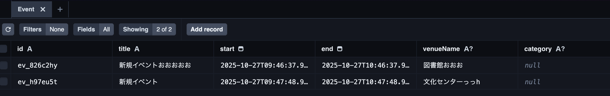

# Prismaとは何か〜実務でどう実装するかまで　to Next.js初心者

## はじめに

普段Next.jsを触っているものの、Next.jsから直接DBアクセスするアプリは実務で触ったことがないです。

ただ、今回個人開発でNext.jsをフルスタックに使ってみることにしたので、Next.jsのDB周りも押さえておこうということで学習してみました。

**Prisma**がNext.jsだとメジャーなようなので今回はPrismaを採用してみることにしました。

## Prismaの重要な用語

記事を読み進める前に、Prismaでよく出てくる用語を理解しておきましょう。

### Prisma Schema

`schema.prisma`というファイルに書く、データベースの設計図です。「どんなテーブルを作るか」「どんなカラムがあるか」などを定義します。Prisma独自の構文で書きます。

```prisma
model User {
  id    Int    @id @default(autoincrement())
  name  String
  email String @unique
}
```

### Prisma Client

データベース操作を行うためのライブラリです。Prisma Schemaを基に**自動生成**されるのが大きな特徴です。

#### Prisma Clientの仕組み

1. `schema.prisma`でデータモデルを定義する
2. `npx prisma generate`を実行する
3. Prisma Clientが自動生成され、型定義も一緒に作られる
4. 生成されたクライアントを使ってデータベース操作を行う

#### なぜ自動生成が便利なのか？

**型安全性**：スキーマに定義したモデルやフィールドが、そのままTypeScriptの型として使えます。存在しないフィールドにアクセスしようとすると、コードを書いている時点でエディタがエラーを出してくれます。

```typescript
import { PrismaClient } from '@prisma/client';
const prisma = new PrismaClient();

// schema.prismaでUserモデルを定義していれば...
const users = await prisma.user.findMany(); // ← userが自動補完される
const user = await prisma.user.findUnique({
  where: { id: 1 }
});

// userの型は自動的に { id: number; name: string; email: string; ... }
console.log(user.email); // ← emailも自動補完される
console.log(user.birthday); // ← エラー！birthdayはスキーマに無い
```

（ORマッパーには苦い思い出があるものの、今回のアプリで複雑なSQLは書く予定はないので旨みだけ十分享受できるでしょうという目論見）

#### いつPrisma Clientを再生成する？

スキーマを変更したら、Prisma Clientも更新する必要があります：

```bash
# スキーマを変更後、マイグレーションを実行
npx prisma migrate dev

# または、マイグレーションせずにクライアントだけ再生成
npx prisma generate
```

`prisma migrate dev`を実行すると、自動的に`prisma generate`も実行されるので、通常はマイグレーション時に一緒に更新されます。

### Prisma Studio

データベースの中身をブラウザで見たり編集したりできるGUIツールです。`npx prisma studio`で起動します。SQLを書かずにデータを確認・操作できるので便利です。



### Model

Prisma Schemaで定義する、データベースのテーブルに対応するものです。1つのModelが1つのテーブルになります。

```prisma
// Userモデル → usersテーブルになる
model User {
  id   Int    @id
  name String
}
```

## Prismaの3つの特徴

### 1. 型安全なデータベース操作

TypeScriptを使っている場合、Prismaは自動的に型定義を生成してくれます。これにより、VSCodeなどのエディタで自動補完が効き、タイプミスによるバグを防げます。

```typescript
// Prismaを使った例
const user = await prisma.user.findUnique({
  where: { id: 1 }
});
// userの型が自動的に推論される！
console.log(user.email); // 自動補完が効く
```

### 2. データベースの種類を気にしなくていい

PostgreSQL、MySQL、SQLite、MongoDB など、様々なデータベースに対応しています。データベースを変更しても、コードをほとんど書き換える必要がありません。

### 3. マイグレーション機能

データベースのテーブル構造を変更する際、Prismaが自動的に変更履歴を管理してくれます。チーム開発でも、全員が同じデータベース構造を共有できます。

## Prismaのインストール

Next.jsプロジェクトにPrismaをインストールしましょう。

```bash
# Prismaのインストール
npm install prisma --save-dev
npm install @prisma/client

# Prismaの初期化
npx prisma init
```

`npx prisma init` を実行すると、以下のファイルが生成されます：

- `prisma/schema.prisma` - データベースの設計図
- `.env` - データベース接続情報

## Prismaの独自ファイル解説

Prismaを使う上で理解しておくべき、Prisma特有の重要なファイルを解説します。

### 1. `schema.prisma` - データベースの設計図

`prisma/schema.prisma` は、Prismaで最も重要なファイルです。このファイルで、データベースの構造を定義します。

#### ファイルの構成

```prisma
// データベース接続の設定
datasource db {
  provider = "postgresql"  // 使用するデータベースの種類
  url      = env("DATABASE_URL")  // 接続URL（.envから読み込む）
}

// Prisma Clientの生成設定
generator client {
  provider = "prisma-client-js"  // JavaScriptクライアントを生成
}

// データモデルの定義
model User {
  id        Int      @id @default(autoincrement())
  email     String   @unique
  name      String?
  createdAt DateTime @default(now())
  posts     Post[]
}

model Post {
  id        Int      @id @default(autoincrement())
  title     String
  content   String?
  published Boolean  @default(false)
  authorId  Int
  author    User     @relation(fields: [authorId], references: [id])
}
```

#### 各セクションの説明

##### datasource ブロック

- `provider`: 使用するデータベースの種類（postgresql, mysql, sqlite, mongodb など）
- `url`: データベースへの接続文字列（通常は環境変数から読み込む）

##### generator ブロック

- Prisma Clientの生成方法を指定
- 通常は `prisma-client-js` を使用

##### model ブロック

- データベースのテーブルに対応
- 各フィールドが列（カラム）になる

#### よく使う型とデコレータ

**基本的なデータ型：**

- `String` - 文字列
- `Int` - 整数
- `Float` - 小数
- `Boolean` - 真偽値
- `DateTime` - 日時
- `Json` - JSON形式のデータ

**主要なデコレータ：**

こっちはPrisma独自なのでAIに聞いたりしちゃうと早い

- `@id` - 主キー（Primary Key）
- `@unique` - 一意制約（重複を許さない）
- `@default()` - デフォルト値
- `@relation()` - リレーション（他のテーブルとの関連）
- `?` - オプショナル（nullを許可）

### 2. `migrations/` - マイグレーションファイル

`prisma/migrations/` ディレクトリには、データベース構造の変更履歴が保存されます。

```text
prisma/
  migrations/
    20231115120000_init/
      migration.sql
    20231116090000_add_user_profile/
      migration.sql
    migration_lock.toml
```

各マイグレーションフォルダには：

- タイムスタンプ付きの名前
- 実際のSQL文が書かれた `migration.sql`

**重要：** マイグレーションファイルは手動で編集しないでください。Prismaが自動生成します。

### 3. `node_modules/.prisma/client/` - 生成されたクライアント

`npx prisma generate` を実行すると、`schema.prisma` を基に型定義付きのクライアントコードが自動生成されます。このディレクトリは触る必要はありませんが、ここに生成されたコードを使ってデータベース操作を行います。

## Prismaの基本的な使い方

### 1. スキーマの定義

まず、`schema.prisma` でデータモデルを定義します。

```prisma
model User {
  id        Int      @id @default(autoincrement())
  email     String   @unique
  name      String
  createdAt DateTime @default(now())
}
```

### 2. マイグレーションの実行

```bash
# マイグレーションファイルを作成し、データベースに適用
npx prisma migrate dev --name init
```

このコマンドは：

1. schema.prismaの変更を検出
2. SQLマイグレーションファイルを生成
3. データベースに変更を適用
4. Prisma Clientを再生成

### 3. Prisma Clientの使用

Next.jsのAPIルートやServer Componentsで使います。

```typescript
// lib/prisma.ts - Prismaクライアントのシングルトン
import { PrismaClient } from '@prisma/client';

const globalForPrisma = global as unknown as { prisma: PrismaClient };

export const prisma =
  globalForPrisma.prisma ||
  new PrismaClient({
    log: ['query'],
  });

if (process.env.NODE_ENV !== 'production') globalForPrisma.prisma = prisma;
```

```typescript
// app/api/users/route.ts - APIルートの例
import { prisma } from '@/lib/prisma';
import { NextResponse } from 'next/server';

export async function GET() {
  const users = await prisma.user.findMany();
  return NextResponse.json(users);
}

export async function POST(request: Request) {
  const body = await request.json();
  const user = await prisma.user.create({
    data: {
      email: body.email,
      name: body.name,
    },
  });
  return NextResponse.json(user);
}
```

## よく使うPrisma操作

### データの作成（Create）

```typescript
// 1件作成
const user = await prisma.user.create({
  data: {
    email: 'user@example.com',
    name: 'John Doe',
  },
});

// 複数件作成
const users = await prisma.user.createMany({
  data: [
    { email: 'user1@example.com', name: 'User 1' },
    { email: 'user2@example.com', name: 'User 2' },
  ],
});
```

### データの読み取り（Read）

```typescript
// 全件取得
const allUsers = await prisma.user.findMany();

// 条件付き取得
const users = await prisma.user.findMany({
  where: {
    email: {
      contains: '@example.com',
    },
  },
  orderBy: {
    createdAt: 'desc',
  },
  take: 10, // 最初の10件
});

// 1件取得（ユニークな条件）
const user = await prisma.user.findUnique({
  where: {
    email: 'user@example.com',
  },
});

// 1件取得（任意の条件）
const user = await prisma.user.findFirst({
  where: {
    name: 'John',
  },
});
```

### データの更新（Update）

```typescript
// 1件更新
const user = await prisma.user.update({
  where: {
    id: 1,
  },
  data: {
    name: 'Updated Name',
  },
});

// 複数件更新
const result = await prisma.user.updateMany({
  where: {
    email: {
      contains: '@old-domain.com',
    },
  },
  data: {
    email: {
      // 注意: updateManyでは単純な値の設定のみ可能
    },
  },
});
```

### データの削除（Delete）

```typescript
// 1件削除
const user = await prisma.user.delete({
  where: {
    id: 1,
  },
});

// 複数件削除
const result = await prisma.user.deleteMany({
  where: {
    createdAt: {
      lt: new Date('2023-01-01'),
    },
  },
});
```

### リレーションを含む操作

```typescript
// ネストしたデータの作成
const user = await prisma.user.create({
  data: {
    email: 'user@example.com',
    name: 'John',
    posts: {
      create: [
        { title: 'First Post', content: 'Hello World' },
        { title: 'Second Post', content: 'Prisma is awesome' },
      ],
    },
  },
});

// リレーションを含む取得
const userWithPosts = await prisma.user.findUnique({
  where: {
    id: 1,
  },
  include: {
    posts: true, // 関連するPostsも取得
  },
});

// 特定のフィールドのみ取得
const user = await prisma.user.findUnique({
  where: {
    id: 1,
  },
  select: {
    id: true,
    email: true,
    posts: {
      select: {
        title: true,
      },
    },
  },
});
```

## Next.jsでの実装例

完全な例として、簡単なブログアプリを作ってみましょう。

### 1. スキーマ定義

```prisma
model Post {
  id        Int      @id @default(autoincrement())
  title     String
  content   String
  published Boolean  @default(false)
  createdAt DateTime @default(now())
  updatedAt DateTime @updatedAt
}
```

### 2. APIルート

```typescript
// app/api/posts/route.ts
import { prisma } from '@/lib/prisma';
import { NextResponse } from 'next/server';

export async function GET() {
  const posts = await prisma.post.findMany({
    where: { published: true },
    orderBy: { createdAt: 'desc' },
  });
  return NextResponse.json(posts);
}

export async function POST(request: Request) {
  const json = await request.json();
  const post = await prisma.post.create({
    data: {
      title: json.title,
      content: json.content,
      published: json.published ?? false,
    },
  });
  return NextResponse.json(post);
}
```

### 3. Server Component

```typescript
// app/posts/page.tsx
import { prisma } from '@/lib/prisma';

export default async function PostsPage() {
  const posts = await prisma.post.findMany({
    where: { published: true },
    orderBy: { createdAt: 'desc' },
  });

  return (
    <div>
      <h1>ブログ記事一覧</h1>
      {posts.map((post) => (
        <article key={post.id}>
          <h2>{post.title}</h2>
          <p>{post.content}</p>
          <time>{post.createdAt.toLocaleDateString('ja-JP')}</time>
        </article>
      ))}
    </div>
  );
}
```

実装イメージとしてはつかみやすいのでこれでよいです。

ただ、実務でこの実装だとだいぶアウトなので次でより実践的な実装を見てみます

### 4. 実務を意識した設計パターン

上記のServer Componentの例では、コンポーネント内で直接Prisma Clientを使っていますが、実務ではこれはアンチパターンです。以下の問題があります：

- **テストが困難**：コンポーネントのテストでデータベースへの接続が必要になる
- **責任の分離ができていない**：UIロジックとデータアクセスロジックが混在
- **再利用性が低い**：他のコンポーネントやAPIルートで同じクエリを使いたい場合、コードが重複する

より良い設計として、**リポジトリパターン**または**サービスレイヤーパターン**を導入しましょう。

#### リポジトリパターンの実装例

まず、データアクセス層を抽象化するインターフェースを定義します。

```typescript
// lib/repositories/post-repository.ts
import { Post } from '@prisma/client';

// インターフェース定義
export interface PostRepository {
  findPublishedPosts(): Promise<Post[]>;
  findById(id: number): Promise<Post | null>;
  create(data: { title: string; content: string; published: boolean }): Promise<Post>;
  update(id: number, data: Partial<Post>): Promise<Post>;
  delete(id: number): Promise<void>;
}

// Prisma実装
import { prisma } from '@/lib/prisma';

export class PrismaPostRepository implements PostRepository {
  async findPublishedPosts(): Promise<Post[]> {
    return prisma.post.findMany({
      where: { published: true },
      orderBy: { createdAt: 'desc' },
    });
  }

  async findById(id: number): Promise<Post | null> {
    return prisma.post.findUnique({
      where: { id },
    });
  }

  async create(data: { title: string; content: string; published: boolean }): Promise<Post> {
    return prisma.post.create({
      data,
    });
  }

  async update(id: number, data: Partial<Post>): Promise<Post> {
    return prisma.post.update({
      where: { id },
      data,
    });
  }

  async delete(id: number): Promise<void> {
    await prisma.post.delete({
      where: { id },
    });
  }
}

// シングルトンインスタンスをエクスポート
export const postRepository = new PrismaPostRepository();
```

次に、Server Componentから利用します。

```typescript
// app/posts/page.tsx
import { postRepository } from '@/lib/repositories/post-repository';

export default async function PostsPage() {
  // リポジトリ経由でデータ取得
  const posts = await postRepository.findPublishedPosts();

  return (
    <div>
      <h1>ブログ記事一覧</h1>
      {posts.map((post) => (
        <article key={post.id}>
          <h2>{post.title}</h2>
          <p>{post.content}</p>
          <time>{post.createdAt.toLocaleDateString('ja-JP')}</time>
        </article>
      ))}
    </div>
  );
}
```

APIルートでも同じリポジトリを使えます。

```typescript
// app/api/posts/route.ts
import { postRepository } from '@/lib/repositories/post-repository';
import { NextResponse } from 'next/server';

export async function GET() {
  const posts = await postRepository.findPublishedPosts();
  return NextResponse.json(posts);
}

export async function POST(request: Request) {
  const json = await request.json();
  const post = await postRepository.create({
    title: json.title,
    content: json.content,
    published: json.published ?? false,
  });
  return NextResponse.json(post);
}
```

#### この設計の利点

##### 1. テストが容易

モックリポジトリを作成して、データベースなしでテストできます。

```typescript
// lib/repositories/__mocks__/post-repository.ts
export class MockPostRepository implements PostRepository {
  private posts: Post[] = [
    { id: 1, title: 'Test Post', content: 'Test Content', published: true, createdAt: new Date(), updatedAt: new Date() }
  ];

  async findPublishedPosts(): Promise<Post[]> {
    return this.posts.filter(p => p.published);
  }

  // 他のメソッドも実装...
}
```

##### 2. データベースの切り替えが容易

将来的にPrismaから別のORMに変更したい場合、リポジトリの実装を差し替えるだけで済みます。インターフェースは変わらないので、コンポーネントやAPIルートのコードは一切変更不要です。

##### 3. ビジネスロジックの集約

複雑なクエリやトランザクション処理をリポジトリに集約できます。

```typescript
// 複雑な処理もリポジトリに集約
export class PrismaPostRepository implements PostRepository {
  async publishPost(id: number): Promise<Post> {
    // トランザクションを使った複雑な処理
    return prisma.$transaction(async (tx) => {
      const post = await tx.post.update({
        where: { id },
        data: { published: true },
      });
      
      // 公開時に通知を送るなどの追加処理
      await tx.notification.create({
        data: {
          message: `Post "${post.title}" has been published`,
        },
      });
      
      return post;
    });
  }
}
```

##### 4. 型安全性の維持

インターフェースを使うことで、TypeScriptの型チェックの恩恵を受けながら、依存性の逆転（Dependency Inversion）を実現できます。

#### さらに進んだパターン：サービスレイヤー

より複雑なビジネスロジックがある場合は、リポジトリの上にサービスレイヤーを追加することもあります。

```typescript
// lib/services/post-service.ts
import { postRepository } from '@/lib/repositories/post-repository';
import { userRepository } from '@/lib/repositories/user-repository';

export class PostService {
  async getPostsWithAuthor() {
    const posts = await postRepository.findPublishedPosts();
    // 複数のリポジトリを組み合わせた複雑な処理
    const postsWithAuthor = await Promise.all(
      posts.map(async (post) => {
        const author = await userRepository.findById(post.authorId);
        return { ...post, author };
      })
    );
    return postsWithAuthor;
  }

  async createPostWithValidation(data: CreatePostInput) {
    // バリデーション
    if (data.title.length < 5) {
      throw new Error('Title must be at least 5 characters');
    }
    
    // ビジネスロジック
    return postRepository.create(data);
  }
}

export const postService = new PostService();
```

このように設計することで、保守性・テスタビリティ・拡張性の高いアプリケーションを構築できます。

## 参考リンク

- [Prisma公式ドキュメント](https://www.prisma.io/docs)
- [Next.js with Prisma](https://www.prisma.io/nextjs)
- [Prisma Examples](https://github.com/prisma/prisma-examples)
